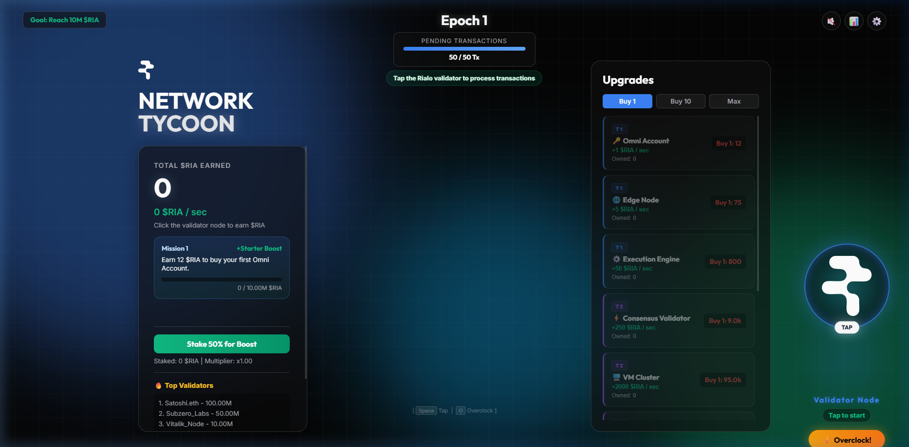

<div align="center">

# 🎮 Rialo Network Tycoon

### Premium Idle/Clicker Web Game with AI Network Theme

[](https://romeototo.github.io/ai-tycoon-rialo-game/)
[](LICENSE)



</div>

---

## 📖 About

**Rialo Network Tycoon** is a premium idle/clicker web game where you build and manage an AI-powered decentralized network. Tap the Rialo validator node, earn **$RIA tokens**, purchase upgrades, and expand your network infrastructure through multiple epochs.

Inspired by the Web3 ecosystem and blockchain validator networks.

## ✨ Features

- 🖱️ **Tap-to-Earn Mechanic** — Click the validator node to process transactions and earn $RIA
- ⬆️ **Upgrade System** — 6+ tiers of upgrades from Omni Accounts to VM Clusters
- 🔥 **Fever Mode** — Tap fast to trigger a temporary earning multiplier
- 📊 **Staking System** — Stake $RIA for passive income boosts
- 🏆 **Mission System** — Complete progressive milestones for bonus rewards
- 🎵 **Sound Effects** — Immersive audio feedback for taps and events
- 💾 **Auto-Save** — Progress saved automatically to localStorage
- 📱 **Responsive Design** — Play on desktop, tablet, or mobile

## 🛠️ Tech Stack


- **Frontend:** Vanilla HTML5, CSS3, JavaScript (no frameworks)
- **Styling:** Dark theme with glassmorphism, CSS animations
- **Storage:** localStorage for game save data
- **Hosting:** GitHub Pages

## 🚀 Play

### Online
👉 **[Play Now — romeototo.github.io/ai-tycoon-rialo-game](https://romeototo.github.io/ai-tycoon-rialo-game/)**

### Local
```bash
git clone https://github.com/romeototo/ai-tycoon-rialo-game.git
cd ai-tycoon-rialo-game
# Open index.html in your browser
```

## 🎯 How to Play

1. **Tap** the Rialo validator node to process transactions
2. **Earn $RIA** tokens with each tap
3. **Buy upgrades** to increase your $RIA per second
4. **Complete missions** to unlock bonuses
5. **Stake $RIA** for multiplier boosts
6. **Progress through epochs** as your network grows

## 📄 License

This project is licensed under the [MIT License](LICENSE).

---

<div align="center">

**Made with ❤️ by [RoMEoTOTO](https://github.com/romeototo)**

[](https://x.com/RoMeoT0T0)
[](https://github.com/romeototo)

</div>
